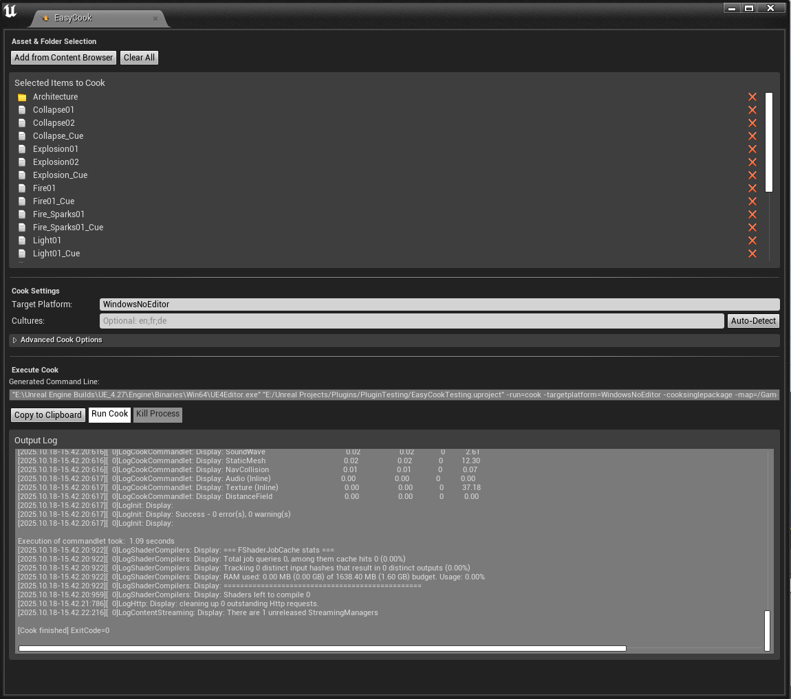

#  EasyCookEditor
EasyCookEditor is a Unreal Editor plugin designed to make asset cooking for Unreal Engine 4 easier, primarily for modding purposes, with a focus on cooked asset projects.

This is the editor version of the Python GUI. It’s faster, smarter with folders, catches duplicates, and is just better all around.



# Why bother?
Traditionally, cooking assets in Unreal relies on placing the assets you want cooked into maps, then specifying that map in the cooking process, this often results in unnecessary cooking of additional shaders, assets, and other content you don’t actually need. This wastes both time and resources.

**EasyCook Editor** solves this by letting you specify exactly which assets or folders to cook. You can:
* Select only what you need using the content browser in editor to cook nothing extra.

## Installation
1. Go to the Releases page
2. Download the latest `.zip` release.
3. Extract the zip, inside you’ll find an `EasyCook` folder containing the plugin files.
4. Move the `EasyCook` folder to one of the following locations:
   * **Project Plugin (recommended):**
     ```
     <YourProject>/Plugins/EasyCook/
     ```
   * **Engine Plugin (for all projects):**
     ```
     <YourEngine>/Engine/Plugins/EasyCook/
     ```
5. Launch (or restart) Unreal Engine.
6. Open the Plugins window and ensure EasyCook is enabled.
7. After enabling, you can access the plugin from the EasyCook tab in the editor.

You can build it yourself using the source if you want to make further modifications, I will not make a guide on how to build, all source included builds perfectly fine.

## How to use
### Open the EasyCook Tab
Once the plugin is installed and enabled, open the EasyCook tab from the Unreal Editor UI. (says easycook, and has the easycook icon)

### Select Items
1. In the Content Browser, select assets and/or folders.
2. Click **Add from Content Browser** on EasyCook to include them in the cook list.
3. To remove entries:
   * Click the cross icon next to an item to remove it individually.
   * OR Click Clear All to remove all entries.

### Configure Target
1. Set the Target Platform
2. Cultures are optional, does not need to have anything inside to cook.
   * Click **Auto-Detect** to automatically read project culture settings.

### Advanced Options
* You can toggle additional cook flags, the most commonly used ones are included as checkboxes. but....
* Optionally, add extra command-line flags in the **Extra Command Line Flags** box
* Quoted fragments are preserved and correctly escaped.

### Preview and Copy
* The Generated Command Line updates automatically as you adjust settings or add assets/folders
* Click Copy to Clipboard to copy the full executable command and arguments, you save it for later or send it to a friend.

### Run and Monitor
* Click **Run Cook** to start the cooking process.
* All output is streamed to the Output Log on the EasyCook window in real time.
* Click Kill Process to stop the current cook.

### Important
* Folders are resolved recursively into packages during command generation. (this can sometimes be resource intensive on folders that contain a lot of assets)
* Duplicate or overlapping items are skipped with a status message.
* Run Cook requires at least one selected asset or folder, otherwise, an error appears in the log.
* Extra flags are tokenized respecting quotes, and tokens with spaces or quotes are properly escaped in the final command.

## Credits
- [Trao-X](https://github.com/Trao-X) for the logo 
